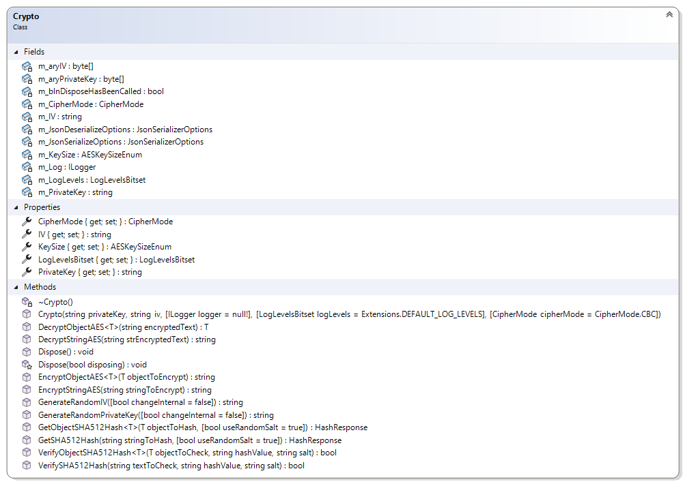
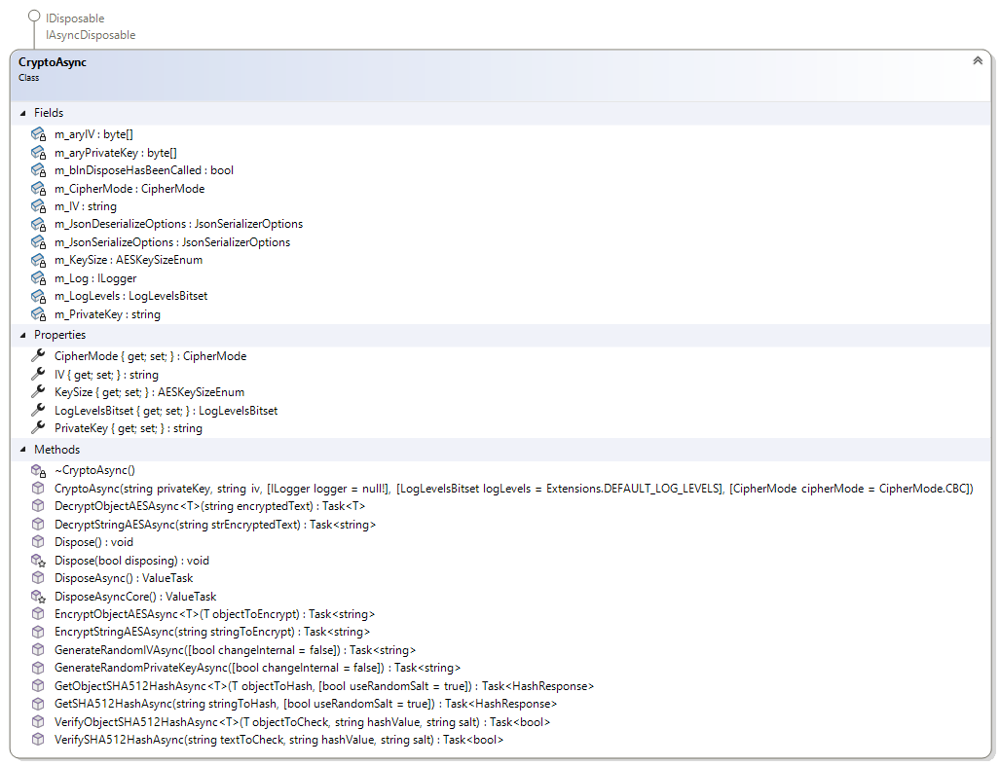
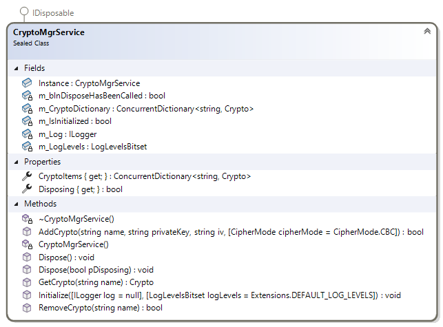
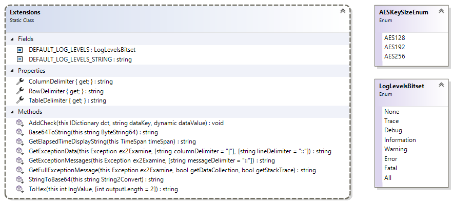
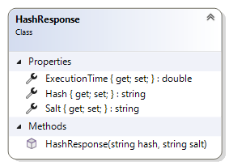

# CryptoMgr

#### Table of Contents

[Overview](#overview)
  * [Crypto.cs](#cryptocs)
    + [Constructor:](#constructor)
    + [Dispose():](#dispose)
    + [Methods:](#methods)
    + [Properties:](#properties)
  * [CryptoAsync.cs](#cryptoasynccs)
    + [Constructor:](#constructor-1)
    + [Dispose() and async ValueTask DisposeAsync():](#dispose-and-async-valuetask-disposeasync)
    + [Methods:](#methods-1)
    + [Properties:](#properties-1)
  * [CryptoMgrService.cs](#CryptoMgrService))
  * [Extensions.cs](#extensionscs)
    + [Enums](#enums)
    + [Static Methods](#static-methods)
  * [HashResponse.cs](#hashresponsecs)
    + [Constructor](#constructor)
    + [Properties](#properties-1)

## Overview
This library is used for synchronous and asynchronous AES encryption and decryption of strings and serializable objects, 
as well as generating a SHA Hash for strings and serializable objects.

The developer should also read the comments in each class for more detailed information.

Some coding techniques are used repeatedly in this library, and are described here.
Each method is timed in code for performance logging and log entries are made when entering and leaving a method, only if the 
LogLevelsBitset includes the Trace bit.  Errors are logged only if the LogLevelsBitset includes the Error bit.
Try-Catch-Finally are used in methods to improve stability and capture runtime data (see the exception's Data dictionary object), 
as well as ensure resources are released when the method ends. Changing the LogLevelsBitset during runtime will take effect when 
the object is instantiated, or immediately of the instantiated object's LogLevelsBitset property is used to change it.

This project automatically builds a NuGet package, Jeff.Jones.CryptoMgr.1.0.0.nupkg.  The package can be found in the 
"CryptoMgr\CryptoMgr\bin\Release" folder or the debug build in "CryptoMgr\CryptoMgr\bin\Debug" folder.

___

## Crypto.cs

This class provides synchronous encryption and decryption, and SHA hashing.
The caller supplies the secret key and initialization vector (IV) for encryption and decryption, and whether to salt the SHA hashing.

### Constructor:
    Crypto(System.String privateKey, 
           System.String iv, 
           Microsoft.Extensions.Logging.ILogger logger = null!, 
           Jeff.Jones.CryptoMgr.LogLevelsBitset logLevels = Extensions.DEFAULT_LOG_LEVELS, 
           CipherMode cipherMode = CipherMode.CBC)

The constructor takes the private key, the initialization vector (iv), an optional Microsoft.Extensions.Logging.ILogger instance 
(defaults to null), a bitset for 1 or more logging levels (defaults to "Error" and "Fatal"), and the desired cipher mode 
(defaults to CBC).  If the key is null or white space, an ArgumentNullException is thrown.  If the iv is null or an empty string, 
it is treated as not having been provided, and the iv is automatically generated if and when the EncryptStringAES() or 
EncryptObjectAES() methods are called.  The IV property would then reflect the actual iv used.  This should be recorded for use 
in decryption later.  It is recommended that the user provide both the key and 16 character iv string in the constructor.
Optionally, the user can provide an empty iv at construction, then call the GenerateRandomIV() to get an iv, and then set the 
IV property to that value.  The generated iv value should still be recorded with the key in a secure location.

### Dispose():
Crypto inherits and implements a thoroughly implemented System.IDisposable interface as well as a destructor.

### Methods:
    System.String GenerateRandomIV(Boolean changeInternal = false)

Generates a 16 character initialization vector (iv) string that the 
caller can use.  Using this method will only change the internal iv value if **changeInternal=true**    

Otherwise, the caller must set the IV property to the value returned by this method to change the internal value.

    System.String GenerateRandomPrivateKey(Boolean changeInternal = false)

Generates a 32 character key string (unless the KeySize property is changed) that the 
caller can use.  Using this method will only change the internal key value if **changeInternal=true**    

Otherwise, the caller must set the PrivateKey property to the value returned by this method to change the internal value.

    System.String EncryptObjectAES<T>(T objectToEncrypt)

Encrypts a serializable object and returns the encrypted string.  The object "T" must be serializable.

    T? DecryptObjectAES<T>(String encryptedText)

Decrypts an encrypted string and returns an instantiated object of type "T".  The object "T" must be serializable.

    System.String EncryptStringAES(String stringToEncrypt)
    
Encrypts a string and returns the encrypted string.

    System.String DecryptStringAES(String strEncryptedText)

Decrypts an encrypted string and returns the decrypted string.

    Jeff.Jones.CryptoMgr.HashResponse GetObjectSHA512Hash<T>(T objectToHash, Boolean useRandomSalt = true)

Returns a SHA256 hash of a serializable object ("T").  The hash is returned within the HashResponse object as a string.  
If "useRandomSalt" is set to true (by default) then each call uses a randomly generated salt to the hash process to improve security.
The HashResponse object contains the Hash string and the Salt string.  The HashResponse.Salt property will be an empty string if
"useRandomSalt" is set to false.  The HashResponse object has a ExecutionTime (System.Double) property that provides how many microseconds 
it took to generate the hash.

    Jeff.Jones.CryptoMgr.HashResponse GetSHA512Hash(String stringToHash, Boolean useRandomSalt = true)

Returns a SHA256 hash of the parameter string.  The hash is returned within the HashResponse object as a string.  
If "useRandomSalt" is set to true (by default) then each call uses a randomly generated salt to the hash process to improve security.
The HashResponse object contains the Hash string and the Salt string.  The HashResponse.Salt property will be an empty string if
"useRandomSalt" is set to false.  The HashResponse object has a ExecutionTime (System.Double) property that provides how many microseconds 
it took to generate the hash.

    System.Boolean VerifySHA512Hash(String textToCheck, String hashValue, String salt)

This method verifies that the unhashed text matches the hashValue, using the salt provided (which can be an empty string if no salt was originally used).
This method is useful to verify some user input matches a known hash value.  Returns true if it is a match, false if not.

    System.Boolean VerifyObjectSHA512Hash<T>(T objectToCheck, String hashValue, String salt)

This method verifies that the serializable object "T" matches the hashValue, using the salt provided (which can be an empty string if no salt was originally used).
This method is useful to verify some object "T" matches a known hash value.  Returns true if it is a match, false if not.

### Properties:
    Jeff.Jones.CryptoMgr.LogLevelsBitset LogLevelsBitset
    
Get/Set.  This can be used to change the logging level during runtime.  The default is "Error" and "Fatal".

    System.String IV
    
Get/Set.  This should be set in the constructor, but may be changed after construction.  If the IV is not set 
in the constructor, it will be automatically generated when the EncryptStringAES() or EncryptObjectAES() methods are called.  
The IV property would then reflect the actual iv used.  This should be recorded for use in decryption later.  
It is recommended that the user provide both the key and 16 character iv string in the constructor.  
Optionally, the user can provide an empty iv at construction, then call the GenerateRandomIV() to get an iv, and 
then set the IV property to that value.  The generated iv value should still be recorded with the key in a secure location.  
If the value provide via constructor or property is not 16 characters, the value will be set to an empty string so a random 
value is generated during Encryption.

    System.String PrivateKey

Get/Set.  This should be set in the constructor, but may be changed after construction.  If the key is not set in the constructor,
an exception is thrown for a null, empty, or whitespace value.  The key is used for encryption and decryption.  The key should be
protected for security reasons.  Setting a key via this property that is null, empty, or a whitespace value, throws an 
ArgumentNullException.  Ideally, the key should be 32 characters long if the KeySize property is 256.

    Jeff.Jones.CryptoMgr.AESKeySizeEnum KeySize

Get/Set.  This specifies the desired key size for encryption and decryption.  The default is 256 bits (meaning 32 characters).

    System.Security.Cryptography.CipherMode CipherMode

Get/Set.  This specifies the desired cipher mode for encryption and decryption.  The default is CBC.

___

## CryptoAsync.cs

This class provides ***asynchronous*** encryption and decryption, and SHA hashing.  The class has the same properties as Crypto.cs, 
and asynchronous methods matching the synchronous methods of Crypto.cs.

The caller supplies the secret key and initialization vector (IV) for encryption and decryption, and whether to salt the SHA hashing.

### Constructor:
    CryptoAsync(System.String privateKey, 
                System.String iv, 
                Microsoft.Extensions.Logging.ILogger logger = null!, 
                Jeff.Jones.CryptoMgr.LogLevelsBitset logLevels = Extensions.DEFAULT_LOG_LEVELS, 
                CipherMode cipherMode = CipherMode.CBC)

The constructor takes the private key, the initialization vector (iv), an optional Microsoft.Extensions.Logging.ILogger instance 
(defaults to null), a bitset for 1 or more logging levels (defaults to "Error" and "Fatal"), and the desired cipher mode 
(defaults to CBC).  If the key is null or white space, an ArgumentNullException is thrown.  If the iv is null or an empty string, 
it is treated as not having been provided, and the iv is automatically generated if and when the EncryptStringAES() or 
EncryptObjectAES() methods are called.  The IV property would then reflect the actual iv used.  This should be recorded for use 
in decryption later.  It is recommended that the user provide both the key and 16 character iv string in the constructor.
Optionally, the user can provide an empty iv at construction, then call the GenerateRandomIV() to get an iv, and then set the 
IV property to that value.  The generated iv value should still be recorded with the key in a secure location.

### Dispose() and async ValueTask DisposeAsync():
CryptoAsync inherits and implements a thoroughly implemented System.IDisposable and System.IAsyncDisposable interface 
as well as a destructor.

### Methods:
    async System.Threading.Tasks.Task<System.String> GenerateRandomIVAsync(System.Boolean changeInternal = false)

Generates a 16 character initialization vector (iv) string that the 
caller can use.  Using this method will only change the internal iv value if **changeInternal=true**    

Otherwise, the caller must set the IV property to the value returned by this method to change the internal value.

    async System.Threading.Tasks.Task<System.String> GenerateRandomPrivateKeyAsync(System.Boolean changeInternal = false)

Generates a 32 character key string (unless the KeySize property is changed) that the 
caller can use.  Using this method will only change the internal key value if **changeInternal=true**    

Otherwise, the caller must set the PrivateKey property to the value returned by this method to change the internal value.

    async System.Threading.Tasks.Task<System.String> EncryptObjectAESAsync<T>(T objectToEncrypt)

Encrypts a serializable object and returns the encrypted string.  The object "T" must be serializable.

    async System.Threading.Tasks.Task<T?> DecryptObjectAESAsync<T>(System.String encryptedText)

Decrypts an encrypted string and returns an instantiated object of type "T".  The object "T" must be serializable.

    async System.Threading.Tasks.Task<System.String> EncryptStringAESAsync(System.String stringToEncrypt)
    
Encrypts a string and returns the encrypted string.

    async System.Threading.Tasks.Task<System.String> DecryptStringAESAsync(System.String strEncryptedText)

Decrypts an encrypted string and returns the decrypted string.

    async System.Threading.Tasks.Task<Jeff.Jones.CryptoMgr.HashResponse> GetObjectSHA512HashAsync<T>(T objectToHash, System.Boolean useRandomSalt = true)

Returns a SHA256 hash of a serializable object ("T").  The hash is returned within the HashResponse object as a string.  
If "useRandomSalt" is set to true (by default) then each call uses a randomly generated salt to the hash process to improve security.
The HashResponse object contains the Hash string and the Salt string.  The HashResponse.Salt property will be an empty string if
"useRandomSalt" is set to false.  The HashResponse object has a ExecutionTime (System.Double) property that provides how many microseconds 
it took to generate the hash.

    async System.Threading.Tasks.Task<Jeff.Jones.CryptoMgr.HashResponse> GetSHA512HashAsync(System.String stringToHash, System.Boolean useRandomSalt = true)

Returns a SHA256 hash of the parameter string.  The hash is returned within the HashResponse object as a string.  
If "useRandomSalt" is set to true (by default) then each call uses a randomly generated salt to the hash process to improve security.
The HashResponse object contains the Hash string and the Salt string.  The HashResponse.Salt property will be an empty string if
"useRandomSalt" is set to false.  The HashResponse object has a ExecutionTime (System.Double) property that provides how many microseconds 
it took to generate the hash.

    async System.Threading.Tasks.Task<System.Boolean> VerifySHA512HashAsync(System.String textToCheck, System.String hashValue, System.String salt)

This method verifies that the unhashed text matches the hashValue, using the salt provided (which can be an empty string if no salt was originally used).
This method is useful to verify some user input matches a known hash value.  Returns true if it is a match, false if not.

    async System.Threading.Tasks.Task<System.Boolean> VerifyObjectSHA512HashAsync<T>(T objectToCheck, System.String hashValue, System.String salt)

This method verifies that the serializable object "T" matches the hashValue, using the salt provided (which can be an empty string if no salt was originally used).
This method is useful to verify some object "T" matches a known hash value.  Returns true if it is a match, false if not.

### Properties:
    Jeff.Jones.CryptoMgr.LogLevelsBitset LogLevelsBitset
    
Get/Set.  This can be used to change the logging level during runtime.  The default is "Error" and "Fatal".

    System.String IV
    
Get/Set.  This should be set in the constructor, but may be changed after construction.  If the IV is not set 
in the constructor, it will be automatically generated when the EncryptStringAES() or EncryptObjectAES() methods are called.  
The IV property would then reflect the actual iv used.  This should be recorded for use in decryption later.  
It is recommended that the user provide both the key and 16 character iv string in the constructor.  
Optionally, the user can provide an empty iv at construction, then call the GenerateRandomIV() to get an iv, and 
then set the IV property to that value.  The generated iv value should still be recorded with the key in a secure location.  
If the value provide via constructor or property is not 16 characters, the value will be set to an empty string so a random 
value is generated during Encryption.

    System.String PrivateKey

Get/Set.  This should be set in the constructor, but may be changed after construction.  If the key is not set in the constructor,
an exception is thrown for a null, empty, or whitespace value.  The key is used for encryption and decryption.  The key should be
protected for security reasons.  Setting a key via this property that is null, empty, or a whitespace value, throws an 
ArgumentNullException.  Ideally, the key should be 32 characters long if the KeySize property is 256.

    Jeff.Jones.CryptoMgr.AESKeySizeEnum KeySize

Get/Set.  This specifies the desired key size for encryption and decryption.  The default is 256 bits (meaning 32 characters).

    System.Security.Cryptography.CipherMode CipherMode

Get/Set.  This specifies the desired cipher mode for encryption and decryption.  The default is CBC.

## CryptoMgrService.cs
]

### Constructor
   
There is no public constructor available.  The class is instantiated with a parameterless private constructor on first reference.

Provides a thread-safe service for managing Crypto instances and operations, implemented as thread-safe singleton.
The benefit of using a singleton is that keeps 1 or more instances of Crypto object(s) in memory for reuse, eliminating the creation and disposal time
while still be accessible through the application.  Each Crypto instance is uniquely identified by a name, and the service supports adding, retrieving, and
removing Crypto instances.  The service is thread-safe and ensures proper disposal of resources. Users must call <see cref="Dispose"/> when the service is no

### Properties
    CryptoMgrService.Instance 

Get only.  This is the only way to get an instance of the CryptoMgrService class.  The instance is created on first reference.

    CryptoMgrService.Instance.CryptoItems

Get only.  This gets a reference to the ConcurrentDictionary<String, Crypto> object that
contains all the Crypto instances that were added via the AddCrypto() method.

    CryptoMgrService.Instance.Disposing

Returns true or false to indicate if the singleton instance is in the process of disposing.

### Methods
    CryptoMgrService.Instance.Initialize(Microsoft.Extensions.Logging.ILogger logger = null!, Jeff.Jones.CryptoMgr.LogLevelsBitset logLevels = Extensions.DEFAULT_LOG_LEVELS)

This method initializes the singleton with an ILogger instance and the debug levels desired.
This method should be called first, before any reference to CryptoMgrService.Instance.
Since a singleton does not support a parameterized constructor, this method is used to provide 
the parameters needed for the singleton that are also shared with the child Crypto objects.

    CryptoMgrService.Instance.AddCryptoString name, String privateKey, String iv, CipherMode cipherMode = CipherMode.CBC)

This method adds a Crypto instance to the ConcurrentDictionary by the name provided.
If that name (case insensitive) already exists, the method wil throw an 
ArgumentException error.

The privateKey and iv are required as parameters, although iv can be an empty string.  
If the privateKey is null, empty, or whitespace, an ArgumentNullException is thrown.
If the iv is null or an empty string, or is less than 16 bytes in length, 
it is treated as not having been provided, and the iv is automatically generated
if and when the EncryptStringAES() or EncryptObjectAES\<T>() method is called.
The generated value may be read via the Crypto.IV property.  The IV property 
would then reflect the actual iv used.  An iv value improves the security of 
the encryption, and by using unique iv values, the same data encrypted with the
same key will have different encrypted values.  The iv value should be recorded for use
in decryption later.  It is recommended that the user provide both the key and 
the 16 character iv string.

    CryptoMgrService.Instance.Dispose()

Developers are supposed to call this method when done with this object.
There is no guarantee when or if the GC will call it, so 
the developer is responsible to.  GC does NOT clean up unmanaged 
resources, so we have to clean those up, too.

    CryptoMgrService.Instance.GetCrypto(String name)

Returns a reference to the Crypto object in the ConcurrentDictionary 
by the name provided.  If the name does not exist, the method returns null.

    CryptoMgrService.Instance.RemoveCrypto(String name)

Removes the named instance of a Crypto object from the ConcurrentDictionary and disposes of it.
Returns true if successful, false if not removed.

## Extensions.cs

### Enums

This class provides two enums and a set of static methods that are extensions to existing classes.

    enum Jeff.Jones.CryptoMgr.LogLevelsBitset

The bitset has a Flags attribute that allows the user to set multiple bits at once.  

Example of its use:

    // Setting the bitset in code.
    LogLevelsBitset myLogLevels = LogLevelsBitset.Error | LogLevelsBitset.Fatal;
    // Log entry in code.  It only executes if the Trace bit is set.
    if ((m_Log != null) && ((m_LogLevels & LogLevelsBitset.Trace) == LogLevelsBitset.Trace))
    {
        m_Log.LogTrace($"Begin CryptoAsync constructor.");
    }
    // Log entry in an exception.
    if ((m_Log != null) && ((m_LogLevels & LogLevelsBitset.Error) == LogLevelsBitset.Error))
    {
        String strError = exUnhandled.GetFullExceptionMessage(true, true);
        m_Log.LogError($"CryptoAsync constructor error. [{strError}].");
    }

The bitset has a lot of versatility, including being able to be changed at runtime to capture more detailed 
logs for a brief time without having to stop and restart.

    enum Jeff.Jones.CryptoMgr.AESKeySizeEnum

This enum provides a way to limit the caller's KeySize choices to only the values supported in AES.

### Static Methods
    static System.String GetFullExceptionMessage(this System.Exception ex2Examine,
                                                      System.Boolean getDataCollection,
                                                      System.Boolean getStackTrace)

This returns a string that contains all the exception messages in the exception and all its inner exceptions.
If getDataCollection is true, the string also contains all the name-value data in the exception's Data dictionary object.
If getStackTrace is true, the string also contains the stack trace for the exception.

    static void AddCheck(this System.Collections.IDictionary dct, System.String dataKey, dynamic dataValue)

This method is used instead of the Add() method, particularly in System.Exception.Data instance.  If the same name is found
in the Data dictionary, the value is updated to be unique.

    static System.String GetElapsedTimeDisplayString(this System.TimeSpan timeSpan)

This extension method to System.TimeSpan returns a string that displays the time in days, hours, minutes, seconds, milliseconds
and nanoseconds.
    
    static System.String GetExceptionMessages(this System.Exception ex2Examine, System.String messageDelimiter = "::")

This extension returns a string that contains all the exception messages in the exception and any inner exceptions.  Each message is
delimited by the string provided in the messageDelimiter parameter.  The default delimiter is "::".

    static System.String GetExceptionData(this System.Exception ex2Examine, System.String columnDelimiter = "|", System.String lineDelimiter = "::")

This extension returns a string that contains all the Data dictionary object name-value pairs messages in the exception and any 
inner exceptions.  Each name-value pair string is delimited by the column and line strings provided in the columnDelimiter parameter
and the lineDelimiter parameter.  The default delimiter is "::".

    static System.String StringToBase64(this System.String String2Convert)

Converts a string to a Base64 format.  See <a href="https://en.wikipedia.org/wiki/Base64" target="_blank">Base64</a> 
for more information on what Base64 is.

    static System.String Base64ToString(this System.String ByteString64)

Converts a Base64 string to a normal string.  See <a href="https://en.wikipedia.org/wiki/Base64" target="_blank">Base64</a> 
for more information on what Base64 is.

    static System.String ToHex(this System.Int32 lngValue, System.Int32 outputLength = 2)

Converts a 32 bit integer to a string hex value.  The outputLength parameter can be used to pad the output with zeros to the left.

___

## HashResponse.cs

This class is used to return the hashed value string and the salt string when hashing a string or serializable object.
The class also contains a System.Double property that provides how many microseconds it took to generate the hash.
With synchronous methods, .NET supports multiple return values such as:

    (System.String hash, System.String salt, System.Double executionTime) = GetSHA512Hash(System.String stringToHash);

However, asynchronous methods do not support multiple return values.  Therefore, for consistency, the HashResponse class 
was created to server both the synchronous and asynchronous methods.

### Constructor
    HashResponse(System.String hash, System.String salt)

"hash" is the string that is the resulting hash, and salt, which can be an empty string, improves the security of the hash over not having a salt string.

### Properties

    System.String Hash { get; set; } = "";

Gets or sets the hashed (not unhashed, original) value associated with the current object.

    System.String Salt { get; set; } = "";

Gets or sets the cryptographic salt value used for hashing operations.

    Double ExecutionTime { get; set; } = 0.0;

Gets or sets the number of microseconds it took to generate the hash.  This is set internally by the method that generates the hash.

___

